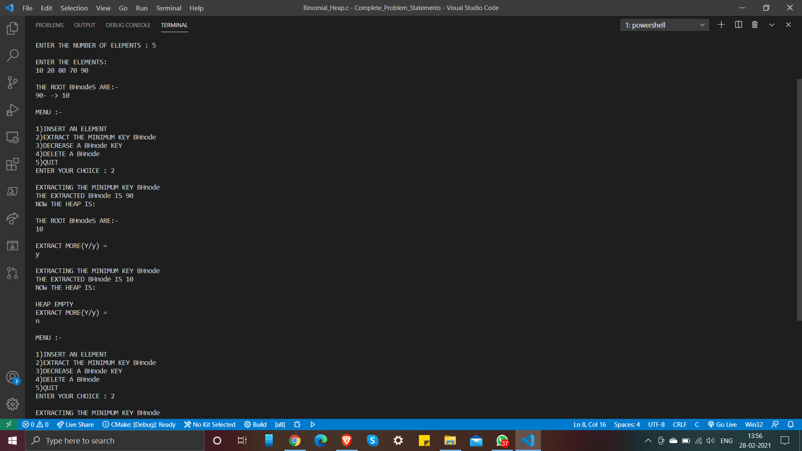

# Binomial Heap

In computer science, a binomial heap is a data structure that acts as a priority queue but also allows pairs of heaps to be merged. It is important as an implementation of the mergeable heap abstract data type (also called meldable heap), which is a priority queue supporting merge operation. It is implemented as a heap similar to a binary heap but using a special tree structure that is different from the complete binary trees used by binary heaps. Binomial heaps were invented in 1978 by Jean Vuillemin.

To know more about Binomial Heap, checkout below links:

- [Geeksforgeeks Article](https://www.geeksforgeeks.org/binomial-heap-2/)
- [Video on Binomial Heap](https://www.youtube.com/watch?v=JCpkcP-VeUQ)
- [Wikipedia](https://en.wikipedia.org/wiki/Binomial_heap)

The Operations implemented into this program are:  

- Insert Key
- Delete Key
- Decrease Key
- Extract Minimum Key

### Output

