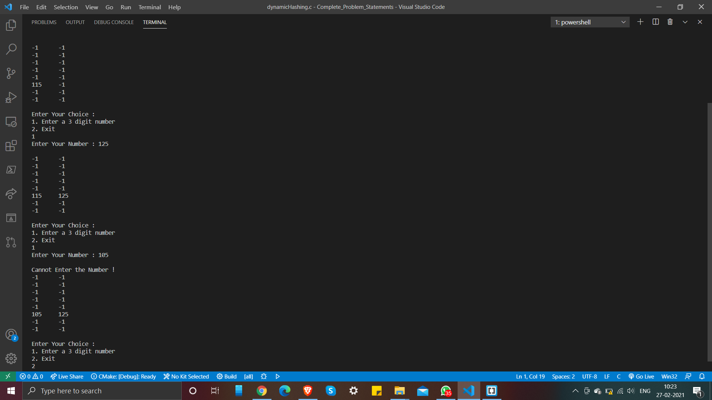

# Dynamic Hashing

- The dynamic hashing method is used to overcome the problems of static hashing like bucket overflow.
- In this method, data buckets grow or shrink as the records increases or decreases. This method is also known as Extendable hashing method.
- This method makes hashing dynamic, i.e., it allows insertion or deletion without resulting in poor performance.

To knw more about Dynamic Hashing, checkout below links:

- [Geeksforgeeks Article](https://www.geeksforgeeks.org/extendible-hashing-dynamic-approach-to-dbms/)
- [Wikipedia](https://en.wikipedia.org/wiki/Extendible_hashing)
- [javaTpoint](https://www.javatpoint.com/dbms-dynamic-hashing)

### Output

