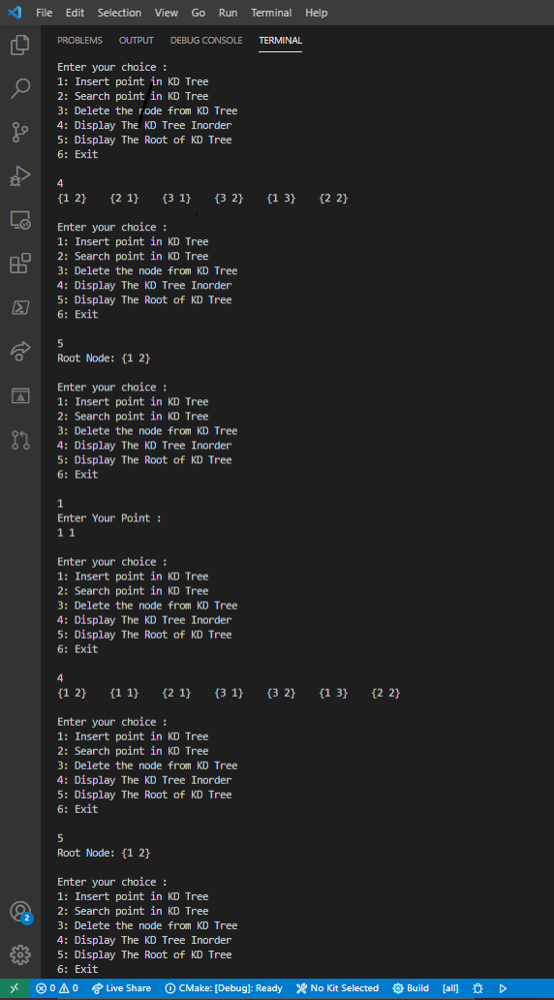

# KD Tree

In computer science, a k-d tree (short for k-dimensional tree) is a space-partitioning data structure for organizing points in a k-dimensional space. k-d trees are a useful data structure for several applications, such as searches involving a multidimensional search key (e.g. range searches and nearest neighbor searches) and creating point clouds. k-d trees are a special case of binary space partitioning trees.

To know more about KD Tree, checkout below links:

- [Geeksforgeeks Article (Set 1)](https://www.geeksforgeeks.org/k-dimensional-tree/)
- [Geeksforgeeks Article (Set 2)](https://www.geeksforgeeks.org/k-dimensional-tree-set-2-find-minimum/)
- [Geeksforgeeks Article (Set 3)](https://www.geeksforgeeks.org/k-dimensional-tree-set-3-delete/?ref=rp)
- [Wikipedia](https://en.wikipedia.org/wiki/K-d_tree)
- [Video on KD Tree](https://www.youtube.com/watch?v=Z4dNLvno-EY)

The Operations implemented into this program are (for the 2 Dimensional Tree):  

- Insert Point
- Search Point
- Delete Point
- Display the Inorder Traversal of KD Tree
- Display the root of KD Tree

### Output

