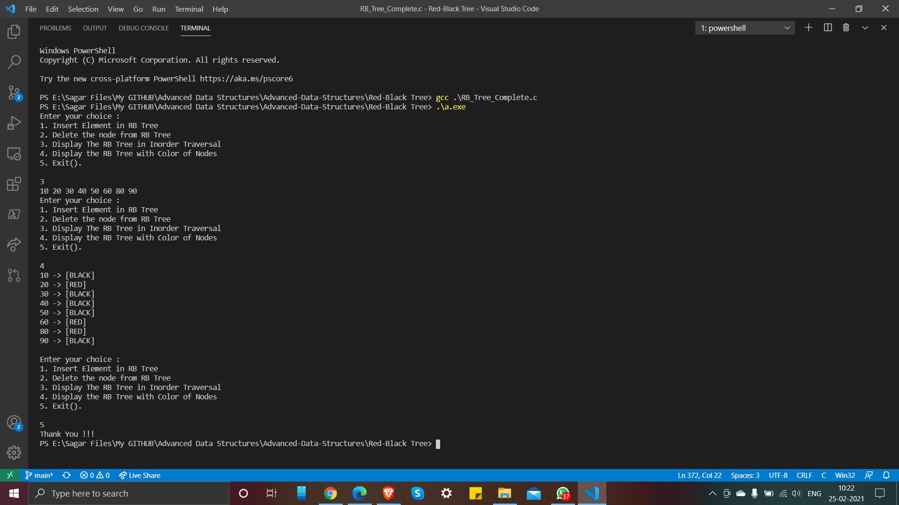

# Red-Black Tree

A red-black tree is a kind of self-balancing binary search tree where each node has an extra bit, and that bit is often interpreted as the colour (red or black). These colours are used to ensure that the tree remains balanced during insertions and deletions. Although the balance of the tree is not perfect, it is good enough to reduce the searching time and maintain it around O(log n) time, where n is the total number of elements in the tree. This tree was invented in 1972 by Rudolf Bayer. 

It must be noted that as each node requires only 1 bit of space to store the colour information, these types of trees show identical memory footprint to the classic (uncoloured) binary search tree. 

To know more about RB Tree, checkout below links:

- [Geeksforgeeks Article](https://www.geeksforgeeks.org/red-black-tree-set-1-introduction-2/)
- [Video on RB Tree](https://www.youtube.com/watch?v=3RQtq7PDHog&list=PLdo5W4Nhv31bbKJzrsKfMpo_grxuLl8LU&index=64&t=1181s)

The Operations implemented into this program are:  

- Insertion
- Deletion
- Display with and without Color Codes

### Output

