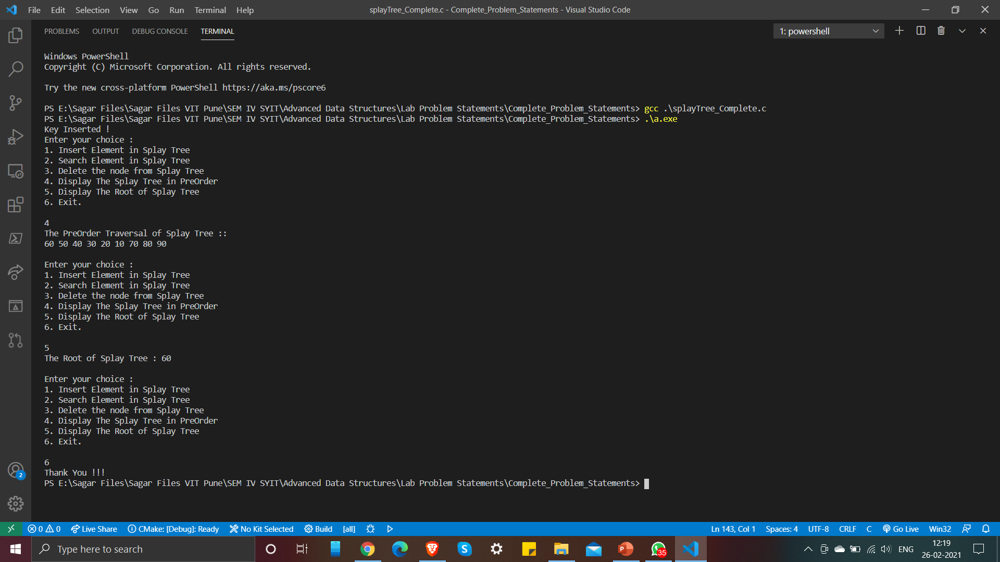

# Splay Tree

A splay tree is a binary search tree with the additional property that recently accessed elements are quick to access again. Like self-balancing binary search trees, a splay tree performs basic operations such as insertion, look-up and removal in O(log n) amortized time. For many sequences of non-random operations, splay trees perform better than other search trees, even performing better than O(log n) for sufficiently non-random patterns, all without requiring advance knowledge of the pattern. The splay tree was invented by Daniel Sleator and Robert Tarjan in 1985. 

To know more about Splay Tree, checkout below links:

- [Geeksforgeeks Article (Search Operation)](https://www.geeksforgeeks.org/splay-tree-set-1-insert/)
- [Geeksforgeeks Article (Insert Operation)](https://www.geeksforgeeks.org/splay-tree-set-2-insert-delete/)
- [Geeksforgeeks Article (Delete Operation)](https://www.geeksforgeeks.org/splay-tree-set-3-delete/?ref=rp)
- [Video on Splay Tree](https://www.youtube.com/watch?v=qMmqOHr75b8)

The Operations implemented into this program are:  

- Search Operation
- Splay Operation
- Insertion
- Deletion
- Display Preorder Traversal of the Splay Tree

### Output

