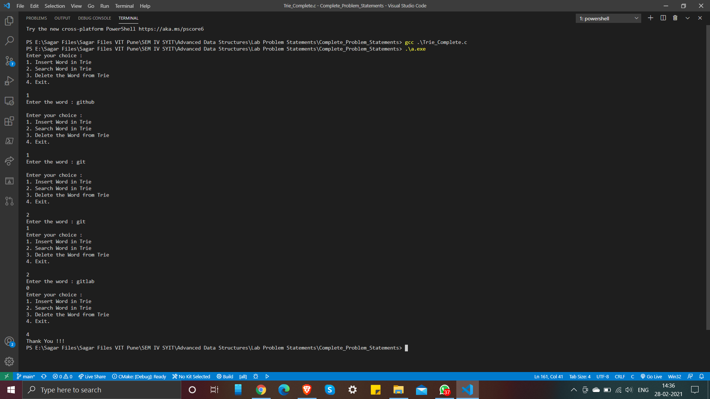

# Trie

In computer science, a trie, also called digital tree or prefix tree, is a type of search tree, a tree data structure used for locating specific keys from within a set. These keys are most often strings, with links between nodes defined not by the entire key, but by individual characters. In order to access a key (to recover its value, change it, or remove it), the trie is traversed depth-first, following the links between nodes, which represent each character in the key.

To know more about Trie, checkout below links:

- [Geeksforgeeks Article (Set 1)](https://www.geeksforgeeks.org/trie-insert-and-search/)
- [Geeksforgeeks Article (Set 2)](https://www.geeksforgeeks.org/trie-delete/)
- [Geeksforgeeks Article (Set 3)](https://www.geeksforgeeks.org/advantages-trie-data-structure/)
- [Wikipedia](https://en.wikipedia.org/wiki/Trie)
- [Video on Trie](https://www.youtube.com/watch?v=GP20ueb16co)

The Operations implemented into this program are:  

- Insert word
- Delete word
- Search word

### Output

